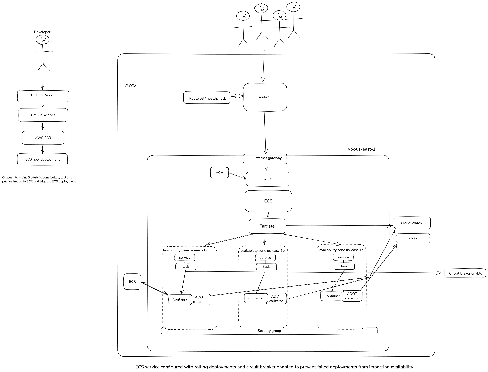

# Pear SRE Exercise: Deploy & Operate a Sample Application.

## Architecture Diagram

## 1. Architecture Overview & Design Decisions
This architecture prioritizes reliability and low operational overhead using AWS managed services.
Traffic is resolved through Route53 and routed to an Application Load Balancer (ALB) with TLS termination via ACM. The ALB distributes requests across ECS Fargate tasks deployed in multiple Availability Zones to ensure high availability while avoiding EC2 management overhead.
CI/CD is implemented with GitHub Actions, which builds and pushes container images to Amazon ECR. ECS performs rolling or blue/green deployments to minimize downtime and reduce deployment risk.
Observability is provided through CloudWatch (metrics and logs) and AWS X-Ray (distributed tracing), leveraging managed integrations to simplify operational complexity.
## 2. Reliability Strategy
High availability is achieved by running ECS tasks across multiple Availability Zones. If one zone fails, traffic is automatically handled by the remaining zones.
Deployments are configured using rolling updates or blue/green strategies. Blue/green deployments allow fast rollback in case of failure, while rolling updates provide a simpler and more cost-efficient option depending on the scenario.
ECS circuit breaker is enabled to automatically stop and roll back failed deployments. This prevents unstable versions from affecting production.
Auto Scaling policies can be configured based on CPU and memory usage. This allows the service to scale up during high demand and scale down when traffic decreases.
Health checks exist at multiple levels. ECS monitors container health and restarts unhealthy tasks automatically. The Application Load Balancer also performs health checks before routing traffic. Route53 health checks can provide additional monitoring and alerting.
For observability, CloudWatch collects logs and metrics, while AWS X-Ray provides distributed tracing. If the application supports OpenTelemetry, traces can be sent to X-Ray to analyze latency and performance bottlenecks.
Alarms should be configured for:
- High error rate (5xx responses)
- High CPU or memory usage
- Task failures
- Unhealthy targets in ALB

If the application supports chaos testing features, they can be used to simulate failure scenarios and validate system resilience.
## 3. Observability Strategy
### Key Metrics
At the infrastructure level:
- CPU utilization per ECS task
- Memory utilization per ECS task
- Number of running tasks vs desired count
- ALB request count
- ALB 4xx/5xx error rate
- Target response time (latency)
- At the application level:
- Request rate (RPS)
- Error rate
- Latency (p95, p99)

### Example Alerts
Critical alerts:
- ALB 5xx error rate > 5% for 5 minutes
- ECS task count below desired count
- CPU > 80% for sustained period
- Memory > 85% for sustained period
- Unhealthy targets in ALB

Warning alerts:
- Increasing latency trend
- High container restarts
- Scaling events happening too frequently

### What an On-Call Engineer Should Check First
When an incident occurs:
- Check ALB 5xx error rate.
- Verify if ECS tasks are healthy and running.
- Review recent deployments.
- Check CPU/memory saturation.
- Review logs in CloudWatch.
- Analyze traces in X-Ray for latency spikes.
This structured approach reduces mean time to resolution (MTTR).

### Prometheus Metrics Integration

The application already exposes Prometheus metrics at `/metrics`.

In ECS Fargate, I would deploy an AWS Distro for OpenTelemetry (ADOT) sidecar container within the same task definition. The sidecar would scrape metrics from the main container and forward them to either:
-   CloudWatch Container Insights

## 4. Trade-offs
This design relies on AWS managed services (ECS Fargate, ALB, CloudWatch), introducing vendor lock-in and reducing portability. In exchange, it minimizes operational overhead and simplifies reliability management.
Compared to Kubernetes or EC2-based deployments, Fargate offers less control and flexibility but is appropriate for a small number of services where simplicity and productivity outweigh orchestration complexity.
Costs may be higher than self-managed infrastructure, but built-in high availability and reduced operational burden justify the trade-off.
### Data and Horizontal Scaling
The application uses a local SQLite file. While multi-AZ ECS tasks improve availability, SQLite’s file-based locking limits write concurrency and horizontal scalability.
For moderate traffic, mounting an Amazon EFS volume provides persistence across tasks. For higher concurrency or long-term growth, migrating to a managed database such as Amazon RDS would better support scalable and reliable operation.
## 5. Future Improvements
If traffic patterns evolve, autoscaling based on business metrics (beyond CPU/memory) could improve efficiency and cost control.
As the number of services grows, migrating to Amazon EKS may provide greater orchestration flexibility at the cost of increased operational complexity.
Adopting GitOps practices (e.g., FluxCD or ArgoCD) would improve deployment consistency and traceability.
A multi-region strategy could enhance disaster recovery, requiring data replication and DNS failover considerations.
Canary deployments could further reduce risk during production rele
